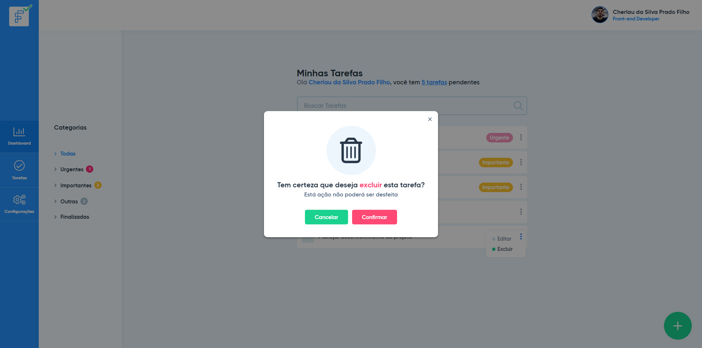
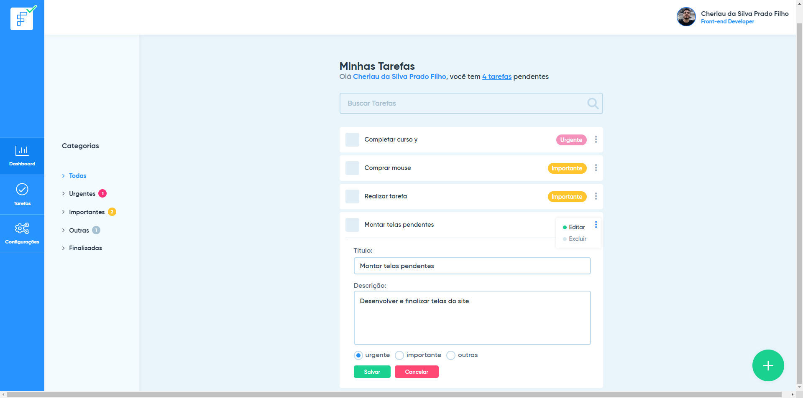
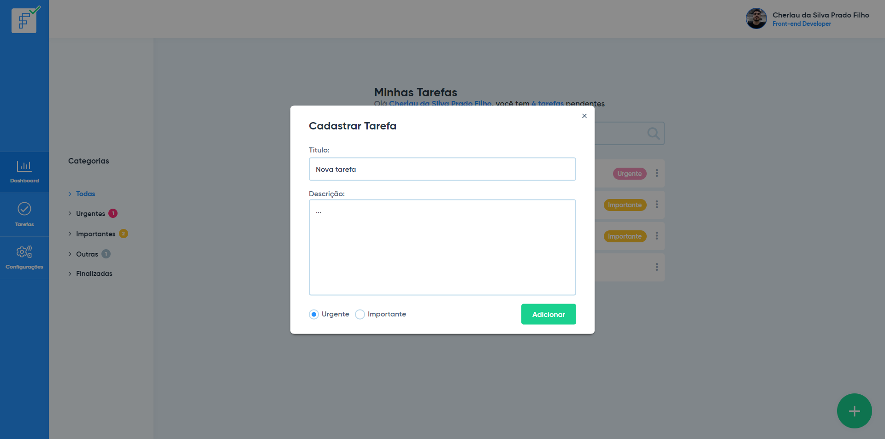

<h1 align="center">Teste para vaga de Front-end developer em Vue.js</h1><br>

<strong>Hospedado:</strong> https://cherlau-facilitatasks.netlify.app/


## 🚧 Projeto
<p align="center">
  
</p>
<p align="center">
  
</p>
<p align="center">
  
</p>
<p align="center">
  
</p>
<p align="center">
  
</p>

<br>

## Clone
```
git clone git@github.com:cherlau/task-manager.git
```

## Project setup
```
npm install
```

### Compiles and hot-reloads for development
```
npm run serve
```

### Compiles and minifies for production
```
npm run build
```

### Lints and fixes files
```
npm run lint
```
<br>

<h2 >Entre em contato 🤙🏽</h2>

<div align="center">
<a href="https://www.linkedin.com/in/cherlau-prado/" target="_blank"></a>
<a href="cherlaufilho@discente.ufg.br" target="_blank"></a>
</div>


